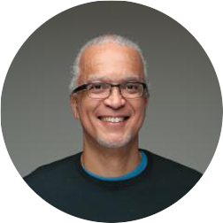

  

  

    
  

  

    <h1 class="speaker-header">Chris Richardson</h1>
    <h2 class="speaker-subtitle">Java Champion and Author of "POJOs in Action"</h2>
    
<a class="speaker-handle" href="https://twitter.com/crichardson" target="_blank">@crichardson</a>

    

        <iframe width="420" height="315" src="http://www.youtube.com/embed/FXCLLsCGY0s" frameborder="0" allowfullscreen></iframe>
      

    <h2 class="speaker-subheader"><strong>biography</strong></h2>
    
Chris Richardson is a developer and architect. He is a Java Champion, a JavaOne rock star and the author of POJOs in Action, which describes how to build enterprise Java applications with frameworks such as Spring and Hibernate. Chris was also the founder of the original CloudFoundry.com, an early Java PaaS for Amazon EC2. Today, he is a recognized thought leader in microservices and speaks regularly at international conferences. Chris is the creator of <a href="http://Microservices.io" target="_blank">Microservices.io</a>, a website describing how to develop and deploy microservices. He provides microservices consulting and training and is working on his third startup <a href="http://eventuate.io/" target="_blank">Eventuate</a>, an application platform for developing microservices. Chris has a computer science degree from the University of Cambridge in England and lives in Oakland, CA.

    <h2 class="conference-emphasis">Two day pre-conference workshop, Sept. 19-20</h2>
    <h2 class="speaker-subheader"><strong>Developing Applications with the Microservice Architecture</strong></h2>
    
    
In this class you will learn a modern approach for building scalable, highly available and easily maintainable applications. We will describe the microservices architecture and show how it enables the agile development and deployment of applications. You will learn about the benefits and drawbacks of the microservice architecture and when they make sense. We will describe key topics including decomposition, service discovery, monitoring, testing, and deployment. By the end of the class you will have built a couple of microservices in Java and deployed them using Docker. You will need to supply your own computer and Java programming environment with build and test facilities.

    <h2 class="conference-emphasis">Talk Session</h2>

    <h2 class="speaker-subheader"><strong>There is no such thing as a microservice!</strong></h2>

    
The microservice architecture is becoming increasingly popular. However, frequent references to using “a microservice to solve a problem” suggest that the concept is not universally well understood. In this talk, I define the microservice architecture as an architectural style and explain what that actually means. I also describe how the primary goal of the microservice architecture is to enable continuous delivery and deployment, and how it achieves that. You will learn why the architecture that you pick for your application matters. And you will learn how to solve key challenges with decomposing an application into microservices. This talk explains why there is no such thing as a microservice!

    <a class="btn" href="https://ti.to/explore-ddd-conference/2017">Buy Tickets</a>

  

