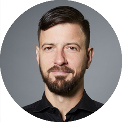

  

    

      
    

    

      <h1 class="speaker-header">Henning Schwentner</h1>
      <h2 class="speaker-subtitle">Domain Storyteller</h2>
      
<a class="speaker-handle" href="https://twitter.com/hschwentner" target="_blank">@hschwentner</a>

      

        <iframe width="420" height="315" src="http://www.youtube.com/embed/MPQfb7fsw3I" frameborder="0" allowfullscreen></iframe>
      

      

      
Henning loves to code. He follows this passion as a software architect and consultant at WPS – Workplace Solutions in Hamburg, Germany. His projects are domain-driven designed, agile and in programming languages like Java, C# and even ABAP. Henning is interested in the evolution of programming languages, long-living software architectures and big refactorings. Recently he translated <em>Domain-Driven Design Distilled</em> into german. Henning is married and has children.

      <h2 class="speaker-subheader">Talk Session</h2>
      <h2 class="speaker-subheader gold">How Domain Storytelling shaped our view of bounded contexts</h2>
      
Co-presented with <a href="Stefan-Hofer.html">Stefan Hofer</a>

      
Domain Storytelling means that we bring together domain experts and developers. We let them tell us stories about their domain. While listening, we record the stories using a pictographic language. The experts can see immediately if we understand their story. After very few stories, we are able to talk about the people, tasks, tools, work items, and events in that domain.

      
Henning and Stefan will demonstrate Domain Storytelling by re-enacting how they modeled ship maneuver planning in the port of Hamburg. You will see that Domain Stories show how people work together within and across contexts – and how unsuitable boundaries prevent people from working together. After all, bounded contexts should separate models, not people.

      <h2 class="speaker-subheader">Hands On Session</h2>
      <h2 class="speaker-subheader gold">Master your domain with Domain Storytelling</h2>
      
Co-presented with <a href="stefan-hofer.html">Stefan Hofer</a>

      
When we want to apply DDD, we must first master the domain. In this hands-on session, we will show you how you can build up domain knowledge with Domain Storytelling. Domain Stories help us better understand a domain and to constitute ubiquitous language. Domain Storytelling means that we bring together domain experts and developers. We let them tell us stories about their domain. While listening, we record the stories using a pictographic language. The experts can see immediately if we understand their story. After very few stories, we are able to talk about the people, tasks, tools, work items, and events in that domain.

      <!--<a class="btn" href="https://ti.to/explore-ddd-conference/2017">Buy Tickets</a>-->
    

  

