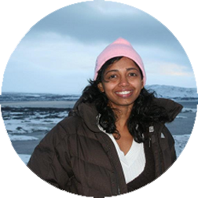

  

    

      
    

    

      <h1 class="speaker-header">Indu Alagarsamy</h1>
      <h2 class="speaker-subtitle">Event-Driven Model Enthusiast</h2>
      
<a class="speaker-handle" href="https://twitter.com/indu_alagarsamy" target="_blank">@indu_alagarsamy</a>

      <h2 class="speaker-subheader"><strong>biography</strong></h2>
      
Indu Alagarsamy has been programming for over 15 years. She is currently part of the development team at Particular Software, the makers of NServiceBus, practicing her passion.

      
Indu is also passionate about diversity and inclusiveness in the tech industry. When not programming, she is either rock climbing in sunny Southern California or spending time with her kids!

      <h2 class="conference-emphasis">Two day pre-conference workshop, Tues-Weds Sept. 11-12</h2>
      <h2 class="speaker-subheader"><a href="../workshops/microservices-done-right.html">Microservices Done Right (with examples in ASP.NET and NServiceBus)</a></h2>
      
We’ll understand service oriented architecture concepts, and DDD concepts such as bounded contexts and data ownership. We’ll apply those concepts to build a simple, yet fully functional, order management system. <a href="../workshops/microservices-done-right.html">Read more...</a>

      <!--<a class="btn" href="https://ti.to/explore-ddd-conference/2017">Buy Tickets</a>-->
    

  

