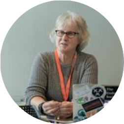

  

  

    
  

  

    <h1 class="speaker-header">Rebecca Wirfs-Brock</h1>
    <h2 class="speaker-subtitle">Object Design Pioneer</h2>
    
<a class="speaker-handle" href="https://twitter.com/rebeccawb" target="_blank">@rebeccawb</a>

    <h2 class="speaker-subheader">biography</h2>
    
Rebecca is an object design pioneer who invented the set of design practices known as Responsibility-Driven Design (RDD) and by accident started the x-Driven Design meme. Along the way she authored two popular object design books that are still in print.

    
In her work, Rebecca’s helps teams hone their design and architecture skills, manage and reduce technical debt, refactor their code, and address architecture risks. In addition to coaching and personal mentoring, she teaches and conducts workshops on Responsibility-Driven Design, Pragmatic TDD, enterprise application design, agile design skills and thinking, being agile about system qualities, and Agile Architecture. In her spare time she jogs (even in the rain).

    
Rebecca is also program director of the <a href="http://www.agilealliance.org/programs/experience-report-program/" target="_blank">Agile Alliance’s Experience Report Initiative</a>. Another interest of hers is software patterns. She serves on the Board of the Hillside Group and recently has written patterns about magic backlogs, sustainable architecture, agile QA, and adaptive systems architectures. If you are interested in writing about your experiences or sharing your wisdom in pattern form, contact Rebecca. She can help you turn your itch for writing into the written word.

  

