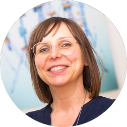

    

      

        
      

      

        <h1 class="speaker-header">Susanne Kaiser</h1>
        

        Independent Tech Consultant at Susanne Kaiser Tech Consulting
        
Susanne Kaiser is an independent tech consultant from Hamburg, Germany. Susanne is supporting organizations with building socio-technical systems. She is passionate about connecting the dots between Wardley Mapping, Domain-Driven Design, and Team Topologies as a holistic approach to design and build adaptive systems for a fast flow of change. Susanne was previously working as a startup CTO and has a background in computer sciences and experience in software development and software architecture since 2002. She is the author of the book <em>Adaptive Systems with Domain-Driven Design, Wardley Mapping, and Team Topologies: Architecture for Flow</em> (Addison-Wesley Signature Series (Vernon), 2022).

      

    

  
  