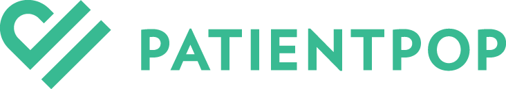

	

		<h1 class="text-center">Sponsors</h1>
		
The Explore DDD Conference is the perfect opportunity to raise your brand awareness amongst key technical influencers and top software development professionals while demonstrating your commitment to technical excellence and support of the software development community.

		
A variety of <a href="Explore DDD 2019 Sponsorship Opportunities.pdf">sponsorship opportunities</a> are available. We can also develop tailored sponsorship packages based on your needs and interests.

		
<a href="mailto:contact@exploreddd.com">Contact us</a> directly if you have any questions about sponsorship.

		<h3 class="text-center">Bronze Sponsor</h3>
		<figure>
			
			<figcaption><a href="https://particular.net">Particular Software</a>, makers of NServiceBus, the most developer-friendly service bus for .NET. At Particular Software, we believe building distributed software systems doesn’t have to be hard. NServiceBus provides the foundation of reliable message processing, publish/subscribe, and business orchestration, while the Particular Service Platform provides the tools to make sure your system is running properly. We enable developers to get the infrastructure out of the way so they can focus on solving business problems.</figcaption>
		</figure>
		<h3 class="text-center">Kickoff Reception Sponsor &amp; Video Sponsor</h3>
		<figure>
			
			<figcaption><a href="http://www.agiledenver.org">Agile Denver</a> is a 501(c)(6) nonprofit that serves the Agile Software Development community in Denver and along Colorado&#39;s Front Range. We are fully volunteer-based, driven by people who are passionate about growing and supporting Agile in our community.</figcaption>
    	</figure>
		<h3 class="text-center">Lunch Sponsor</h3>
		<figure>
			
			<figcaption><a href="https://www.patientpop.com">PatientPop</a> delivers an all-in-one technology solution empowering healthcare providers to promote their practices online, attract new patients, and retain more patients for life. With PatientPop, providers can enhance and automate each touchpoint in the patient journey — from first impressions online to online appointment scheduling to post-visit follow-ups — helping to improve the overall patient experience and reduce tedious front-office tasks. PatientPop’s R&D department empowers responsible, autonomous teams to use the right technologies to solve the right problems, while leveraging Event Storming and DDD to evolve the entire PatientPop system. For more product information and career opportunities, visit <a href="https://www.patientpop.com">patientpop.com</a>.</figcaption>
		</figure>
	

