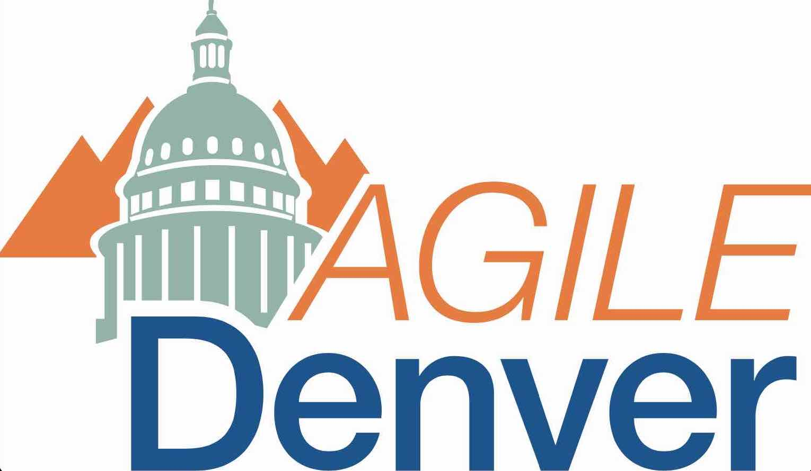

    

        <h1 class="text-center">Sponsors</h1>
        
The Explore DDD Conference is the perfect opportunity to raise your brand awareness amongst key technical influencers and top software development professionals while demonstrating your commitment to technical excellence and support of the software development community.

        
A variety of <a href="Explore DDD 2024 Sponsorship Opportunities-v2.pdf">sponsorship opportunities</a> are available. We can also develop tailored sponsorship packages based on your needs and interests.

        
<a href="mailto:contact@exploreddd.com">Contact us</a> directly if you have any questions about sponsorship.

        <h3 class="text-center">Silver Sponsor</h3>
        <figure>
            
            <figcaption><a href="https://temporal.io">Temporal</a> is an open source durable execution platform that abstracts away the complexity of building scalable, distributed applications and lets developers focus on what matters – delivering reliable applications, faster. It improves meaningful engineering metrics that are directly tied to revenue, like development velocity and system reliability, and allows you to track every step of every application execution, so you gain valuable insight into your business. Temporal Cloud provides a managed service backed by the originators of the project. It has been adopted by thousands for mission-critical applications, including Stripe, Netflix, AlaskaAir, Snap, Datadog, and Hashicorp. Learn more at temporal.io. <a href="https://temporal.io">temporal.io</a></figcaption>
        </figure>
        <h3 class="text-center">Bronze Sponsors</h3>
        <figure>
            
            <figcaption><a href="https://www.aftermansoftware.com">Afterman Software</a> is a complete IT services firm, offering consulting, training, architectural and development services. They have a dedicated focus on DDD, messaging, and event driven systems.</figcaption>
        </figure>
        <figure>
            
            <figcaption><a href="https://www.agiledenver.org/">Agile Denver</a> is a non-profit, outreach organization stewarding a vibrant agile community across the Front Range of the Rocky Mountains. We connect our community to engage, explore, and evolve so that we can improve our ways of working.</figcaption>
        </figure>
        <figure>
            
            <figcaption><a href="https://www.singlestoneconsulting.com/">SingleStone</a> is a technology consulting firm that provides architecture modernization, software development, cloud engineering, UX design, data engineering and analysis, and change and project management services. We design, create, and engineer tools and processes that elevate your employee and customer experience, and ultimately drive better results for your business.</figcaption>
        </figure>
        <figure>
            
            <figcaption><a href="https://www.domaincomponents.com">Domain Components</a> is a boutique technology services firm that provides architecture advisory services for customers. Based out of the Silicon Valley, Domain Components unique approach to architecture processes called ArchAssured has gained rapid traction among multiple customers in a short frame of time.</figcaption>
        </figure>
         <figure>
            
            <figcaption>Established by Vaughn Vernon, <a href="https://www.kalele.io">Kalele</a> is a boutique consultancy dedicated to helping businesses innovate within complex business domains. We excel in providing clients with comprehensive training and consulting services, leading advanced strategic and tactical designs along with implementations. Let's collaborate to navigate challenges and exceed business expectations.</figcaption>
        </figure>
        <h3 class="text-center">Media Partner</h3>
        <figure>
            
            <figcaption><a href="https://www.avanscoperta.it/en/?utm_source=sito&utm_medium=mention&utm_campaign=sponsorship">Avanscoperta</a> is a growing community of professionals who are passionate about learning. We love exploring uncharted territories within software development, sharing experiences and spreading new ideas through consulting activities, training classes, events, and books.</figcaption>
        </figure>
    

