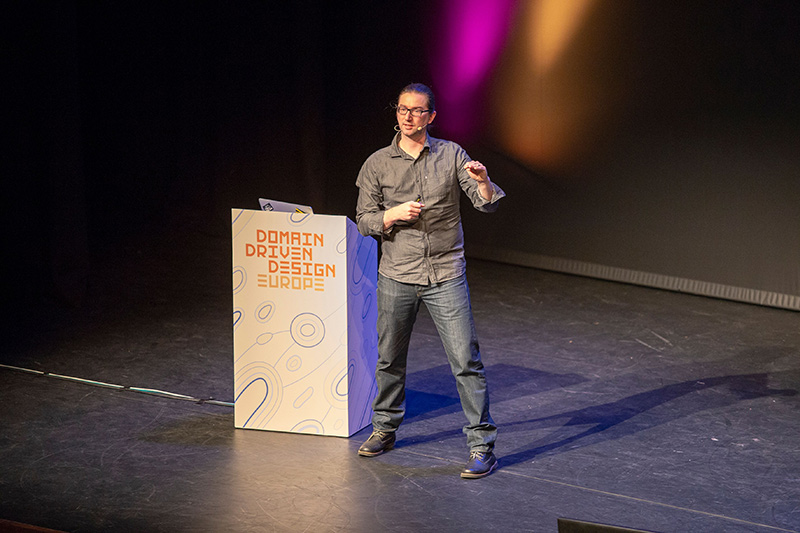

    

      

        

            <a href="../speakers/adam-tornhill.html">

</a>
            

        

        

            <h1>Code as a Crime Scene: Fix Technical Debt with Behavioral Code Analysis</h1>
            
<a href="../speakers/adam-tornhill.html">Adam Tornhill</a>
            1-Day Workshop Wed, Sept 18

            
            
In this workshop you learn novel analysis techniques that support both technical and organizational decisions around your codebase. The techniques use data from the most underused informational source that we have in our industry: our version-control system. Combined with metaphors from forensic psychology you learn to analyze version-control data to:

            <ul>
                <li>Identify the code that’s most expensive to maintain amongst millions lines of code.</li>
                <li>Detect architectural decay and learn to control it.</li>
                <li>Analyse different architectures such as layers and microservices.</li>
                <li>Measure how multiple developers influence code quality and what you can do about it.</li>
                <li>Uncover the social side of your codebase and learn to use the data to guide on- and off-boarding.</li>
            </ul>
            
During the workshop you get access to CodeScene – a project analysis tool that automates the analyses – which we use for the practical exercises. We also discuss open source alternatives such as Git for data mining and the Code Maat command line tool. Participants are encouraged to take this opportunity to analyse their own codebase and get specific take-away information around their system.

            <h2 class="speaker-subheader">Workshop Style</h2>
            
Hands-on, bring your own laptop. The practical exercises use Git and CodeScene. Make sure you have a Git client and a Java run-time, version 8, installed on your laptop if you want to analyze your organization's private repositories.

            
This workshop has evolved over the past four years to reflect advances in behavioral code analysis. Since 2015, the teacher has delivered the workshop ~20 times. The workshop has received high grades on all conferences (8-10 on a scale 1-10).

            
The instructor has written two books on the subject, Your Code As A Crime Scene and Software Design X-Rays, and the workshop builds on those books.

            
            <h2 class="speaker-subheader">Prerequisites</h2>
            
The workshop is language neutral. The target audience is architects, senior developers, and technical managers. While we won't write any code during the workshop, the participants need to be comfortable with reading code. Detailed preparations with installation instructions for the tools will be sent out in advance.

            

                <a class="btn" href="https://ti.to/eddd/explore-ddd-2019">REGISTER NOW</a>
            

        

    

