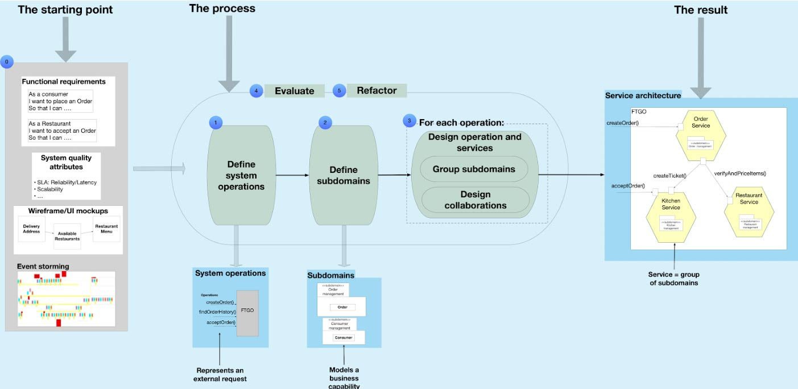

    

        

            

                <a href="../speakers/chris-richardson.html">

</a>
            

        

        

            <h1>DESIGNING MICROSERVICES: RESPONSIBILITIES, APIs AND COLLABORATIONS</h1>
            
<a href="../speakers/chris-richardson.html">Chris Richardson</a>
            2-Day Workshop Tue-Wed, Mar 12-13

            
When applying the microservice architecture pattern, the most important design decisions that you must make do not involve technology choices, such as Kubernetes vs. Serverless or REST vs. gRPC. Instead, what’s critical to your success is correctly identifying services, defining their responsibilities, APIs and collaborations. That’s because if you design your services badly, you risk creating a fragile, distributed monolith where every service is a potential point of failure, and services regularly change in lock step.

            
Through a combination of lectures, discussions, and kata exercises, Chris will walk you through distilling your application’s requirements into a collection of loosely coupled, appropriately-sized services.

            
<a class="btn" href="https://ti.to/EDDD/explore-ddd-2024">REGISTER NOW</a>

            
            <h2>What you will learn</h2>
            
Learn how to:

            <ul>
                <li>Identify and define services</li>
                <li>Design operations that span multiple services using patterns such as Saga and CQRS</li>
                <li>Evaluate a microservice architecture and identify architectural smells</li>
                <li>Refactor and improve an architecture</li>
                <li>Document a microservice architecture</li>
            </ul>
            <h2>Outline</h2>
            <ul>
                <li>Lecture: How to define a microservice architecture
                    <ul>
                        <li>The architecture definition process overview</li>
                        <li>Using the dark energy and dark matter forces to define services</li>
                        <li>Documenting a microservice architecture</li>
                    </ul>
                </li>
                <li>Lecture: Discovering and defining system operations</li>
                <li>Kata (design exercise): Define system operations
                <li>Lecture: Discovering and defining subdomains
                <li>Kata: Define subdomains
                <li>Lecture: Overview of designing system operations
                <li>Lecture: Designing system commands
                    <ul>
                        <li>Partitioning subdomains to form services</li>
                        <li>Applying the command collaboration patterns: Saga and Command-side replica</li>
                    </ul>
                </li>
                <li>Kata: Designing commands and designing services</li>
                <li>Lecture: Designing queries
                    <ul>
                        <li>Partitioning subdomains to form services</li>
                        <li>Applying the query collaboration patterns: API composition and CQRS</li>
                    </ul>
                <li>Kata: Designing queries and designing services</li>
                <li>Lecture: Evaluating microservices and identifying architectural smells</li>
                <li>Kata: Evaluating an architecture</li>
                <li>Lecture: Refactoring a microservice architecture</li>
                <li>Kata: Refactor a microservice architecture</li>
            </ul>
        

    

