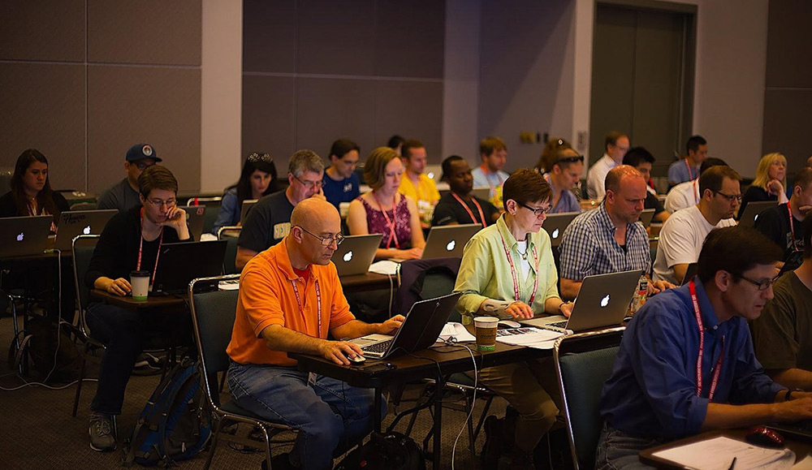

    

      

            

                

                

            

            

                <h1>Reasoning Systemically</h1>
                
Diana Montalion
                March 23-26, 2021 9:00 AM - 12:30 PM (MDT)

                 
                <h2>Overview</h2>
                
As complexity increases, are you (too often) shouting into the wind? Do you see icebergs ahead yet fail to convince others to avoid them? Are your discussions more exhausting than productive? Does the accountant understand the value of your work?

                
Argumentation -- reasoning systematically in support of an idea, action, or theory -- is an essential and valuable skill to develop. Especially for those who practice DDD. Over time, maturing this skill contributes more value than our technology-specific expertise.

                
When we practice argumentation, we discover the best possible solution or conclusion, under the circumstances, when conditions are uncertain. Conditions are always uncertain. Framing systemic reasoning with others provides integration leadership. This leadership does not depend on our job title. Everyone can develop confidence and trust in the thinking they facilitate. Everyone can cultivate a process that builds trust between people.

                
Argumentation works, which is the most important reason to practice it. And when done well, it is creatively energizing.

                <h2>What you’ll learn</h2>
                <h3>Session 1: Designing argumentation</h3>
                <ul>
                    <li>What is argumentation?
                        <ul>
                            <li>A means of inquiry</li>
                            <li>A skill we must practice</li>
                            <li>The integration of differing  points of view</li>
                            <li>Enabling others to make up their own mind</li>
                            <li>Good judgment</li>
                        </ul>
                    </li>
                    <li>What argumentation is not:
                        <ul>
                            <li>Arguing by assertion (opinion giving)</li>
                            <li>Always possible</li>
                        </ul>
                    </li>
                </ul>
                
Exercises include: A retrospective to identify areas we’ll focus on together. What good experiences have you had? What difficult experiences have you had?

                <h2>Session 2: Practicing argumentation</h2>
                <ul>
                    <li>Identify the claim</li>
                    <li>Identify the reasons that support it</li>
                    <li>Strengthen those reasons (including defining words you use)</li>
                    <li>Put the reasons in a natural order</li>
                    <li>Edit, edit, edit</li>
                </ul>
                
Exercises include: Develop a claim and reasons, drawing from a real-life situation. Give and get feedback for strengthening it.

                <h2>Session 3: Working with doubt and fallacious thinking</h2>
                
Doubt is the <em>experience</em> of uncertainty. There is <strong>always</strong> uncertainty.

                
We doubt our own thoughts, feelings, or strategies. We doubt other people’s point of view, claims, assertions. We doubt whenever we change.

                
A companion to doubt is a logical fallacy. Fallacies are thinking patterns that seem right because they are common. But they are, in fact, unsound. For example, “Live free or die”, the New Hampshire state motto (US), is a False Dichotomy. We need to expose them because they hijack argumentation.

                
Exercises include: Identifying doubt in our circumstances and how to practice with it. Logical fallacies quiz! How many do you recognize? Have any taken hold in your practice?

                <h2>Session 4: How to practice … together</h2>
                
This is entirely hands-on.

                <ul>
                    <li>Identity and claim and reasons.</li>
                    <li>Strengthen the reasons together.</li>
                    <li>Listen critically and respectfully.</li>
                    <li>Consider the evidence and diverse points of view on purpose.</li>
                    <li>Seek to strengthen the cohesion.</li>
                    <li>Be aware of our feelings and opinions.</li>
                </ul>
                
Exercises include: Building real-world claims and strengthening reasons in small groups. As a whole, we will also consider two potentially-opposing views of a claim.

                <h2>Logistics</h2>
                
This virtual workshop will use tooms like Zoom and Mural to create community, comfort and shared space for exploring. Registration is limited to encourage interaction. Sign up early, we’ll maintain a waiting list.

                <h2>Feedback from previous sessions</h2>
                
<em>"I am often involved in such discussions as receiver of arguments and in most cases the offered solution only solves symptoms, doesn’t go deep enough. Now I have advice ready why and how to go deeper."</em>

                
<em>"I went in with something that was more of a vague frustration for me and ended up with a well-organized argument that I’d feel comfortable bringing up with anyone."</em>

                <h2 class="text-center">About Diana Montalion</h2>
                

                
<strong>Mentrix Group: Principal, Architecture</strong>

                
If you’ve read The Economist, donated to Wikipedia, or contributed to The World Monuments Fund, you’ve interacted with systems that Diana helped to architect.

                
She has 15+ years experience delivering initiatives, independently or as part of a professional services group, to clients including Stanford, The Gates Foundation and Teach For All. She is co-founder of Mentrix Group, a consultancy providing enterprise systems architecture, technology strategy, and content systems development. She also takes meeting notes with a fountain pen and is an aspiring plant chef.

                

                    <a class="btn" href="https://ti.to/EDDD/explore-ddd-2021-spring-workshops">REGISTER NOW</a>
                

            

        

    

