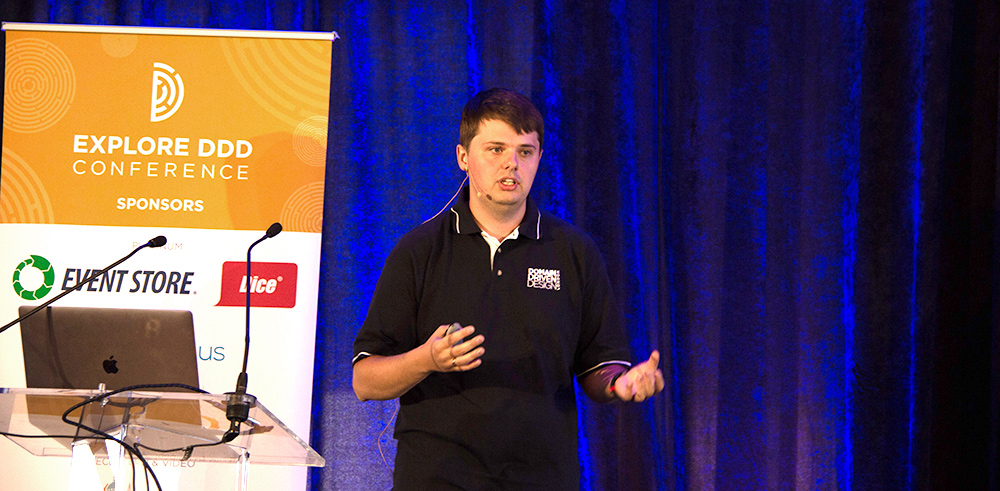

    

      

            

                

                

            

            

                <h1>Domain-Driven Design Modeling Process: From Problem to Solution Space</h1>
                
Kacper Gunia
                March 2-5, 2021 9:00 AM - 12:30 PM (MDT)

                
                
Breaking a large domain into subsystems is an exercise that many companies are going through when they kick off a new project or decide to migrate from a monolith architecture to microservices. The approach of creating a number of loosely coupled software services promises to bring a lot of benefits. These include improving team autonomy, reducing lead time, being able to innovate, and other traits that describe accelerated delivery cycles.

                
In theory, by making services smaller we should be able to improve the metrics and benefit from a new architecture, but such an approach is missing an important point. If we want to have truly autonomous teams and services that are not tightly coupled with each other, first we need to understand the domain.

                
In this training session, we will dive into exploring and understanding the domain - our problem space. With this knowledge, we will be able to design a loosely coupled microservice system aligned with business needs and organizational structure. In order to achieve these goals, the participants will learn and use a number of tools and techniques. Starting with Big Picture Event Storming, through choosing boundaries using Design Heuristics, and validating them with Message Flows. Next, we will be evaluating contexts with Core Domain Charts, designing teams using Team Topologies, formalizing contexts with Bounded Context Canvas, and ending on aggregate modeling with Aggregate Design Canvas.

                <h2>Who is this for?</h2>
                
Senior Software Developer, Architects, Principles, and Technical Product Managers responsible for leading the discovery and delivery efforts of complex software systems.

                
No prior DDD experience is required, but this workshop is targeted at senior people and assumes experience with building systems with multiple teams collaborating with each other.

                <h2>What you&#39;ll learn</h2>
                <ul>
                    <li>Explore and understand a business domain using Event Storming</li>
                    <li>Choose service boundaries using modeling heuristics</li>
                    <li>Validate design and identify coupling in a system using message flows</li>
                    <li>Classify contexts and prioritize areas for strategic investment</li>
                    <li>Organize teams aligned with the business, domain, and cognitive load</li>
                    <li>Create a domain model of a subsystem, define its public interface and policies, commands, events, and policies driving the implementation</li>
                    <li>Explain the steps involved in Domain-Driven Design Modelling Process</li>
                </ul>
                <h2>Agenda</h2>
                
Each session is 4 hours long

                <h3>Session 1</h3>
                <ul>
                    <li>DDD Modelling Process overview</li>
                    <li>Introduction to the training domain</li>
                    <li>Big-Picture Event Storming</li>
                </ul>
                <h3>Session 2</h3>
                <ul>
                    <li>Bounded Contexts</li>
                    <li>Decomposing large systems with Design Heuristics</li>
                    <li>Validating boundaries with Message Flows</li>
                </ul>
                <h3>Session 3</h3>
                <ul>
                    <li>Bounded Context classifications</li>
                    <li>Introduction to Team Topologies</li>
                    <li>Aligning teams and Bounded Contexts</li>
                </ul>
                <h3>Session 4</h3>
                <ul>
                    <li>Bounded Context Canvas</li>
                    <li>Design-level Event Storming</li>
                    <li>Aggregate Design Canvas</li>
                </ul>
                <h2>Prerequisites</h2>
                
Minimum 5 years of professional background, experience working on software projects involving multiple teams and systems.

                <h2 class="text-center">About Kacper Gunia</h2>
                

                
Kacper Gunia is an independent software consultant with 10 years of experience in the industry. He built applications and systems for clients including Starbucks, Time Inc, FeelUnique, Johnston Press &amp; William Hill. On a daily basis he supports and trains client’s teams on using right technologies, processes and approaches such as Domain-Driven Design, Iterative delivery, CI/CD &amp; Functional Programming.

                

                    <a class="btn" href="https://ti.to/EDDD/explore-ddd-2021-spring-workshops">REGISTER NOW</a>
                

            

        

    

