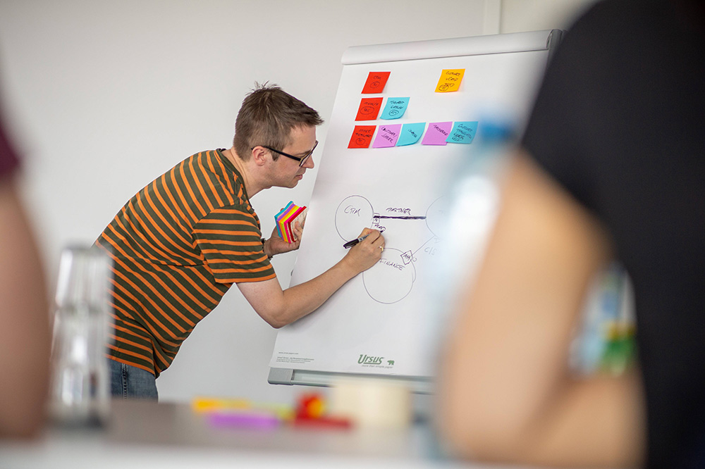
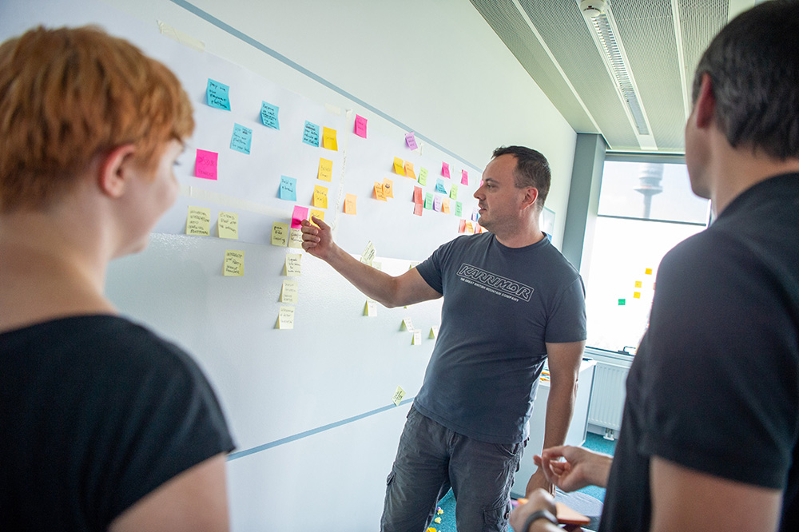

    

      

            

                

                

            

            

                <h1>Collaborative DDD with Storystorming</h1>
                
Martin Schimak
                April 13-16, 2021 9:00 AM - 12:30 PM (MDT)

                
This workshop will take you on a journey through the exciting field of visual and collaborative modeling and mapping methods. By applying lightweight methods, domain and software experts can collaboratively work their way through all three pillars of Domain-Driven Design: <strong>Strategic Design, Collaborative Modeling</strong> and <strong>Modeling in Software</strong>.

                
Together we will work with <strong>Domain Storytelling, Event Storming, Context Mapping, Impact Mapping, User Story Mapping, Event Modeling</strong> and <strong>Example Mapping</strong>. We will examine how such methods can be applied using the colors and building blocks defined with <a href="https://storystorming.com">Storystorming</a> and visually connect the dots.

                
                
In our first six sessions you will experience how to

                <ul>
                    <li><strong>Explore important domain scenarios</strong> with Domain Storytelling</li>
                    <li><strong>Discover a big picture of your domain</strong> with Event Storming</li>
                    <li><strong>Make the implicit power of definition explicit</strong> with Context Mapping</li>
                    <li><strong>Manage your backlog</strong> with Impact Mapping and User Story Mapping</li>
                    <li><strong>Design user journeys and software systems</strong> with Event Modeling</li>
                    <li><strong>Refine user stories and acceptance criteria</strong> with Example Mapping</li>
                </ul>
                
We will then spend two sessions exploring the important but often neglected topic of

                <ul>
                    <li><strong>Modeling (semi-) automated business processes and sagas</strong></li>
                </ul>
                
Using the four message types defined with Storystorming (which are based on the sentence types of human language), we will design a multi-step service collaboration and examine the options we have for autonomy and coupling in the software and in our organization.

                <h2>Who is this for?</h2>
                
This workshop is really aimed at three groups - in no particular order!

                <ol>
                    <li>Tech-savvy domain experts who are interested in better software projects</li>
                    <li>Agile business analysts who are interested in lightweight modeling methods</li>
                    <li>Software developers and architects who are interested in domain experts ;)</li>
                </ol>
                
                <h2>What you will learn</h2>
                <ol>
                    <li>Shaping the ubiquitous language around all three pillars of DDD</li>
                    <li>Collaborating about strategic DDD on the green or brownfield</li>
                    <li>Enabling team autonomy and responsibility for models and components</li>
                    <li>Exploring project strategy and prioritizing epics and user stories</li>
                    <li>Aligning mental models (not only) in a context of Event Sourcing & CQRS</li>
                    <li>Defining and refining system behavior with Specification by Example</li>
                    <li>Designing business processes and sagas using four message types</li>
                </ol>
                
Each session lasts around 90+ minutes and will consist of knowledge transfer, a hands-on whiteboard activity, and time for questions and discussions. Each participant receives all of the material shown by the trainer as a handout for personal use.

                
For remote workshops, we’ll be using Zoom Video Conference and Miro Online Whiteboard.

                <h2>Agenda</h2>
                <h3>Session 1</h3>
                    
Knowledge: Shaping the ubiquitous language around all three pillars of DDD

                    
Hands-On: Explore important domain scenarios with Domain Storytelling

                <h3>Session 2</h3>
                    
Knowledge: Collaborating about strategic DDD on the green or brownfield

                    
Hands-On: Discover a big picture of your domain with Event Storming

                <h3>Session 3</h3>
                    
Knowledge: Enabling team autonomy and responsibility for models and components

                    
Hands-On: Make the implicit power of definition explicit with Context Mapping

                <h3>Session 4</h3>
                    
Knowledge: Exploring project strategy and prioritizing epics and user stories

                    
Hands-On: Manage your backlog with Impact Mapping and User Story Mapping

                <h3>Session 5</h3>
                    
Knowledge: Aligning mental models (not only) in a context of Event Sourcing & CQRS

                    
Hands-On: Design user journeys and software systems with Event Modeling

                <h3>Session 6</h3>
                    
Knowledge: Defining and refining system behavior with Specification by Example

                    
Hands-On: Refine user stories and acceptance criteria with Example Mapping

                <h3>Session 7 + 8</h3>
                    
Knowledge: Designing business processes and sagas using four message types

                    
Hands-On: Specify a multi-step service collaboration with Storystorming

                <h2>Prerequisites</h2>
                <ul>
                    <li>As a business stakeholder: a genuine interest in fundamental properties of software</li>
                    <li>As a software engineer: a genuine interest in understanding a business or new domain</li>
                    <li>Recommended: some work experience with cross-functional, Agile environments</li>
                </ul>
                <h2 class="text-center">About Martin Schimak</h2>
                

                
At the age of ten Martin fell in love with coding. Later he left his love and studied business and law. Only to find out: that’s awesome for programming business software! In the 15+ years since then he talked to energy traders, telecom people, wind tunnel experts and many others. They formed a hands-on domain decoder with a passion for DDD and a soft spot for colored sticky notes. Martin is a trainer with experience in 50+ companies and 10+ countries. He regularly speaks at meetups and conferences across Europe - and from time to time in the US.

                

                    <a class="btn" href="https://ti.to/EDDD/explore-ddd-2021-spring-workshops">REGISTER NOW</a>
                

            

        

    

