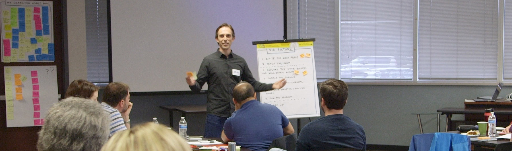

    

      

            

                

                

            

            

                <h1>EventStorming Facilitation Virtual Workshop</h1>
                
Paul Rayner
                April 6-9, 2021 9:00 AM - 12:00 PM (MDT)

                
Collaboration between different disciplines in your organization can be difficult, and finding clarity and alignment on both the right problem to solve and the right solution design even more so. We each approach improvement from our own (limited) perspective, without taking into account the whole story. How is that effective?

                
EventStorming is a workshop format that promotes collaboration between different disciplines in order to solve business problems in the most effective way.

                <h2>What you will learn</h2>
                
In this <strong>highly hands-on and interactive virtual workshop</strong> you'll learn advanced EventStorming facilitation skills spanning from <strong>large scale business discovery</strong> to <strong>collaborative solution design</strong> at the team level.

                
Learn how to facilitate the different EventStorming formats applied to real business problems, taking into account the <strong>different perspectives</strong> (including the facilitator). Practice applying EventStorming to various problems, reflecting on your learning and questions as we go deeper into the techniques.

                
Learn tips and tricks for effective facilitation of collaborative workshops in both in-person and virtual settings, and practice planning anEventStorming session for your own context.

                
<em>"We really enjoyed the EventStorming workshop!  Paul’s facilitation style and methodology made the exercise easy to understand, and participation and collaboration came with ease.  He’s very good at tactfully encouraging differing opinions through thoughtful discussion. The workshop was a huge success with a highly valuable end result!"</em>

                
                <h3>Session 1 - EventStorming as a big picture discovery tool</h3>
                <ul>
                    <li>Quick kick-off: where are we and where we want to go.</li>
                    <li>EventStorming dry-run: modeling a narrative.</li>
                    <li>Exploring the whole using Big Picture EventStorming - mastering complexity and unknowns in large scale modeling.</li>
                    <li>Identifying emergent boundaries through structural elements such as key events.</li>
                    <li>Managing conflicts, highlighting risk, and the problems really worth solving.</li>
                    <li>EventStorming as a platform for problem solving.</li>
                </ul>
                <h3>Session 2 - Using EventStorming to model a process</h3>
                <ul>
                    <li><strong>Process Modeling EventStorming</strong>: a cross-discipline platform for collaborative modeling.</li>
                    <li>Improving our process exploring motivations of different actors.</li>
                    <li>A different perspective on software design: the picture that explains everything.</li>
                    <li>Make policies explicit.</li>
                    <li>Design around value: hidden and explicit motivators.</li>
                    <li>Constraining modeling to specific business cases to stay focused</li>
                </ul>
                <h3>Session 3 - Using EventStorming to design a system</h3>
                <ul>
                    <li>Design-Level EventStorming: leveraging collaborative modeling to sketch bullet-proof models quickly.</li>
                    <li>Aggregates and consistency: independent moving parts in a large system.</li>
                    <li>Design around the bottleneck: changing the rules of the game.</li>
                    <li>Blend user experience design and service design into software design.</li>
                    <li>Triggering bullet-proof design with visible state.</li>
                    <li>The transaction illusion.</li>
                    <li>From sticky notes to working software. When to go for a sophisticated architecture.</li>
                </ul>
                <h3 class="text-center">Session 4 - Putting it all into practice</h3>
                <ul>
                    <li>Virtual and in-person facilitation tips and tricks</li>
                    <li>Design your own EventStorming workshop and present it for feedback.</li>
                </ul>
                <h2>Workshop Format</h2>
                <ul>
                    <li>Four instructor-led hands-on 3 hour online class sessions.</li>
                    <li>Live instruction using Zoom and Miro (i.e. collaborative online whiteboard) in each session.</li>
                    <li>After every workshop session you’ll have time for deep-dive discussions during optional “office hours” sessions with Paul, your instructor.</li>
                    <li>You will need a good webcam, internet connection and microphone to participate in this workshop. <strong>In order to maximize engagement, we require all participants keep their webcams on during the workshop</strong>.</li>
                    <li>We will send you detailed instructions for the workshop a couple of weeks prior.</li>
                    <li>Upon finishing the class you will receive an electronic certificate of completion.</li>
                </ul>
                
This workshop is highly hands-on, varied, and interactive. We will be doing group exercises in Zoom breakout rooms. By spreading the training into shorter interactive virtual sessions, we minimize the impact to your daily work and keep your energy levels high.

                
Virtual learning can be intense, so there will be scheduled breaks every hour. Plus, if your kids interrupt, dogs bark, or you need to step away for a bit, that's just part of the experience and perfectly fine with us. Our goal is for you to leave the workshop energized and ready to put into practice what you've learned. In attending this virtual workshop you agree to:

                <ul>
                    <li>Be present while also taking care of your needs.</li>
                    <li>Extend empathy and acceptance to the other participants.</li>
                    <li>Be on video and avoid unnecessary distractions.</li>
                </ul>
                
                <h2>Who Should Attend</h2>
                
Anybody who works in software teams or with software teams will be able to fully participate in this workshop and take away concrete skills they can apply in real working situations. This includes software developers, architects, testers, product owners, business analysts, delivery managers, engineering managers, directors, and CTOs.

                
<em>"Our EventStorming session with Paul was a huge success. He’s very adept at guiding and informing the process while allowing participants to storm, discuss and ultimately reach their own conclusions. We emerged from the session with a much better understanding and greater agreement around our domains."</em>

                <h2>About Paul Rayner</h2>
                

                
Paul Rayner is a developer, instructor, coach, consultant, and popular conference speaker with over thirty years of software development experience.

                
Paul is the founder and chair of the <a href="http://exploreddd.com/">Explore DDD conference</a>, the premier Domain-Driven Design conference in North America, and co-founder of DDD Denver. He is also the author of <a href="https://leanpub.com/eventstorming_handbook">The EventStorming Handbook</a> and contributor to <a href="https://www.amazon.com/Behavior-Driven-Development-Cucumber-Specification-Example/dp/0321772636">Behavior-Driven Development with Cucumber</a>.

                
Paul provides DDD and EventStorming training and coaching through <a href="http://virtualgenius.com/">Virtual Genius</a>. He lives in Denver, Colorado, with his wife and two teenagers.

                

                    <a class="btn" href="https://ti.to/EDDD/explore-ddd-2021-spring-workshops">REGISTER NOW</a>
                

            

        

    

