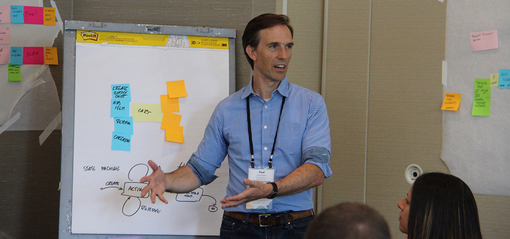

    

      

            

                

                

            

            

                <h1>Essential DDD</h1>
                
Paul Rayner
                October 20-23, 2020 9:00 AM - 12:30 PM (MDT)

                
                
<strong>This virtual workshop consists of 4 sessions from 9 am-12:30 pm (MDT):  Sep 28, 29 and Oct 1, 2.</strong>

                
How do we overcome the overwhelming complexity of our business domains and quickly build software applications that evolve and adapt effectively?

                
Domain-Driven Design (DDD) is an approach to software development that promotes collaboration between different disciplines to solve complex business problems in the most effective way.

                
<strong>The aim of DDD is accelerating development for teams dealing with domain complexity.</strong>

                <h2>What you will learn</h2>
                
In this workshop, you'll gain a thorough understanding of what DDD looks like, why it matters, and how to apply it to you, your team, and your organization. This workshop will provide you with a solid grounding in the foundational ideas, techniques and skills for doing DDD well in your own project context.

                
<strong>DDD is about shortening the time to value for customers, and doing this in a sustainable, repeatable manner.</strong>

                
Being both a way of thinking and a set of priorities, DDD can sometimes be perceived as overly abstract and amorphous. We'll overcome that by connecting everything in DDD together, highlighting what's most important, and give you practical tools to take away and apply on your project immediately.

                
                <h2>Workshop Format</h2>
                <ul>
                    <li>Four instructor-led interactive 3 hour online class sessions.</li>
                    <li>Live instruction using Zoom and Miro (i.e. collaborative online whiteboard) in each session.</li>
                    <li>Hands-on practice during each session.</li>
                    <li>Practical homework for you to practice in your own context between sessions and share your learning with your fellow participants.</li>
                </ul>
                <h3>This workshop is not your typical online boring death-by-bullet-point lecture marathon.</h3>
                
The workshop is highly hands-on, varied, and interactive. We will be doing pairing and group exercises. We will be reading code, but no coding experience is necessary.

                
<strong>By spreading the training into four shorter interactive virtual sessions, we minimize the impact to your daily work and keep your energy levels high.</strong>

                
Virtual learning can be intense, so there will be scheduled breaks every hour. Plus, if your kids interrupt, dogs bark, or you need to step away for a bit, that's just part of the experience and perfectly fine with us. Our goal is for you to leave each class session energized and ready to put into practice what you've learned. In attending this virtual workshop you agree to:

                <ul>
                    <li>Be present while also taking care of your needs.</li>
                    <li>Extend empathy and acceptance to the other participants.</li>
                    <li>Be on video, at least most of the time (we will be taking breaks).</li>
                </ul>
                <h2>Workshop Schedule</h2>
                
<strong>9am-12:30 PM (CDT) - Tuesday, Oct 20 - Friday, Oct 23</strong>

                <h3>Days 1 &amp; 2 - Collaborative Modeling with People and Code</h3>
                <ul>
                    <li>Understand what kinds of business problems DDD addresses.</li>
                    <li>The central role of software design and how DDD fits in.</li>
                    <li>Bridging the communication gap between business and technical people.</li>
                    <li>Domain modeling by example for whole–team collaborative domain discovery.</li>
                    <li>Applying EventStorming to model and design a business process effectively.</li>
                    <li>Refactoring code towards a ubiquitous language.</li>
                </ul>
                <h3>Days 3 &amp; 4 - Supple Design and Strategic Focus</h3>
                <ul>
                    <li>Applying 5 key building block patterns for expressive modeling in code.</li>
                    <li>Using context mapping to help manage large–scale, multi–team design efforts.</li>
                    <li>Identifying where applying DDD will have the greatest impact—your core domain.</li>
                    <li>Architectural patterns to support DDD.</li>
                </ul>
                
We recommend you wear comfortable clothes, and use your preferred note-taking devices (paper & pen, iPad etc.). We will be reading some code, not writing it, so you won't need an IDE or any dev tools to participate. <strong>You will need a webcam and microphone, and access to Zoom and Miro to participate in this workshop.</strong>

                <h2>Who Should Attend</h2>
                
Anybody who works in software teams or with software teams will be able to fully participate in this workshop and take away concrete skills they can apply in real working situations. This includes software developers, architects, testers/QA, DevOps/DevSecOps, Product managers/owners, BA's, delivery managers, engineering managers and directors, and CTOs.

                <h2>About Paul Rayner</h2>
                

                
Paul Rayner is a developer, instructor, coach, consultant, and popular conference speaker with over thirty years of software development experience.

                
Paul is the founder and chair of the Explore DDD conference, the premier domain-driven design conference in North America, and co-founder of DDD Denver. He is also the author of The EventStorming Handbook, and contributor to Behavior-Driven Development with Cucumber.

                
He provides software design training and coaching through Virtual Genius. He lives in Denver, Colorado, with his wife and two teenagers.

                <h2>Testimonials</h2>
                
<strong>"This training connects the dots of the core concepts of DDD with a good mix of theory, experience & hands-on learning. It allowed me to find what the next step should be in my learning and applying to my DDD journey."</strong>

                
<strong>"Immersive. Understandable. Awesome! Paul has an excellent grasp of the concepts he teaches, and his techniques really help cement what is taught in your mind. He's an excellent communicator. I really enjoyed the way you taught this class."</strong>

                
<strong>"Fun, interesting, applicable!"</strong>

                
<strong>"This class is going to change the way you do your modeling and help you code maintainability and readability."</strong>

                
<strong>"This training is wonderful! You will really deep dive into DDD topics and be able to exercise what you learn in an environment that supports collaboration and learning through practice. The experience is further customized by group conversations involving how the lesson topics apply to different areas of confusion or difficulty in your company. This makes the lessons easy to take back to the office and apply with your team."</strong>

                
<strong>"Informative, eye opening, and practical. Paul's examples are very helpful and tangible! It helped me connect academic concepts to real world examples."</strong>

                

                    <a class="btn" href="https://ti.to/EDDD/explore-ddd-2020-virtual-workshops">REGISTER NOW</a>
                

            

        

    

