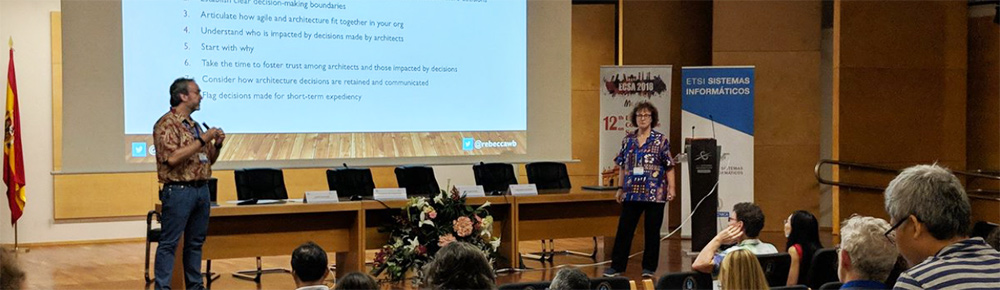

    

      

            

                

                

            

            

                <h1>Decision-Making Practices for Evolving and Sustaining Software Architecture</h1>
                
Rebecca Wirfs-Brock &amp; Ken Power
                The first four Tuesdays in March 2021 (March 2, 9, 16, 23) 9:00 AM - 1:00 PM (MST/MDT)

                
                
When you decide on a direction for your architecture, you set a context that constrains future decisions, for better or worse. Consequently, you accept responsibility for conditions the team, business, and customers will live with, possibly for years to come. And yet, our architectures need to evolve over time. Certain decisions have more impact than others and some decisions might need revisiting. Architecture agility implies responding to change and opportunity using decision-making approaches appropriate to the context.

                
This workshop is for you if you share responsibility for the difficult decisions that contribute to evolving your product or system. In addition to developing and evolving the technical systems, you share responsibility towards developing your organization's people and culture. These responsibilities may include gaining consensus among many diverse people and groups around decisions that impact your architecture.

                
In this hands-on workshop, you will learn and apply specific decision styles and decision-making models that are useful in different architectural contexts. We will begin with methods that help us make sense of the situation and the architecture's context. We then explore various topics, including weighing options, taking action through making design decisions, designing experiments, and resolving problems.

                
You will also learn practical techniques for influencing your organization's culture and capturing, retaining, and communicating architect decisions across time. Throughout the workshop, you will learn and apply different decision models and have the option to focus on your specific challenges.

                <h2>What you will learn</h2>
                <ul>
                    <li>Models for making architecture decisions in different contexts</li>
                    <li>Effective approaches to evolve your architecture over time, and respond to different challenges, risks, and opportunities as they arise</li>
                    <li>Techniques for developing a deeper understanding of the context of your architecture</li>
                    <li>How to design and perform architecture experiments and their role in decision-making</li>
                    <li>How to capture and apply architecture heuristics and their role in decision-making</li>
                    <li>Practical tools to capture and communicate architecture decisions and significant architecture requirements over time</li>
                    <li>Strategies to influence your organization to make and follow through on architecture decisions</li>
                </ul>
                <h2>Workshop Format</h2>
                <ul>
                    <li>Four interactive 4-hour online workshop sessions.</li>
                    <li>Live workshop sessions using Zoom and other online collaboration tools in each session.</li>
                    <li>Hands-on practice, discussion, and reflection during each session.</li>
                    <li>Practical homework for you to practice in your own work context between sessions, and share your learning and challenges with fellow workshop participants.</li>
                    <li>Opportunity to bring your real scenarios (challenges and opportunities) to the sessions, and use them in the workshop activities.</li>
                </ul>
                
This workshop is not your typical online death-by-bullet-point lecture marathon. The workshop is highly hands-on, varied, and interactive. We will be doing hands-on exercises. We will be discussing architecture and reviewing architecture artifacts.

                
By spreading this training into four shorter, interactive virtual sessions over four weeks, our aim is to minimize the impact on your daily work schedule while keeping your engagement and energy levels high.

                
Virtual learning can be intense, so there will be breaks throughout each session. Plus, if your kids interrupt, dogs bark or you need to step away for a bit, that's just part of the experience and perfectly fine with us. Our goal is for you to leave each class session energized and ready to put into practice what you've learned.

                
In attending this virtual workshop you agree to:

                <ul>
                    <li>Be present while also taking care of your needs.</li>
                    <li>Extend empathy and acceptance to the other participants.</li>
                    <li>We appreciate you being on video if that is possible for you, though we respect that circumstances don’t always allow for that, so do what’s best for you and your learning experience.</li>
                </ul>
                <h2>Workshop Schedule</h2>
                <h3>Day 1 & 2 - Decision Models for Software Architecture</h3>
                <ul>
                    <li>Sensemaking in software architecture: Understanding our context so we can make appropriate decisions</li>
                    <li>Decision models for evolving architectures in different contexts</li>
                    <li>The nature and roles of experts and expertise in architecture decisions</li>
                    <li>Knowledge management and software architecture</li>
                    <li>Recording significant  architecture decisions using Architecture Decision Records</li>
                    <li>The relationships between architecture and agility</li>
                </ul>
                <h3>Day 3 & 4 - Taking Context-Aware Action to Improve our Architectures</h3>
                <ul>
                    <li>How organization culture affects software architecture decisions</li>
                    <li>Evolving architecture through deliberate experiments</li>
                    <li>Using heuristics to share architecture evolution strategies</li>
                    <li>How different characteristics of time impact decisions to evolve architecture</li>
                    <li>Establishing Architecture Landing Zones to guide architecture decisions</li>
                    <li>Applying these decision models and approaches to a variety of scenarios</li>
                </ul>
                <h2>Who Should Attend</h2>
                
Anybody who works with software architecture in some capacity will be able to fully participate in this workshop and take away concrete skills they can apply in real working situations. This includes, but is not limited to, software architects, technical leaders, software developers, testers/QA, DevOps/DevSecOps, Product managers/owners, BA's, delivery managers, engineering managers and directors, and CTOs.

                <h2 class="text-center">About Rebecca and Ken</h2>
                <h3>Rebecca Wirfs-Brock</h3>
                

                
Rebecca is an object design pioneer who invented the set of design practices known as Responsibility-Driven Design (RDD) and by accident started the x-Driven Design meme. Along the way, she authored two popular object design books that are still in print.

                
In her work, Rebecca helps teams hone their design and architecture skills, manage and reduce technical debt, refactor their code, and address architecture risks. In addition to coaching and personal design mentoring, she teaches and conducts workshops on Responsibility-Driven Design, design heuristics, and design thinking, being agile about system qualities, and Agile Architecture. In her spare time she jogs (even in the rain).

                
Rebecca is also program director of the <a href="http://www.agilealliance.org/programs/experience-report-program/">Agile Alliance’s Experience Report Initiative</a>. She is co-chair of the experience report tracks for both the XP and Agile conferences. She serves on the advisory board for IEEE Software and on The Hillside Group board. She co-founded Agile Open Northwest Conference and served on the Agile Alliance board and as IEEE Software’s Design Columnist. Another interest of hers is software patterns. She serves on the Board of the Hillside Group and recently has written essays on heuristics and patterns, as well as patterns about magic backlogs, sustainable architecture, agile QA, and adaptive systems architectures. If you are interested in writing about your experiences or sharing your wisdom in pattern form, contact Rebecca. She can help you turn your itch for writing into the written word.

                <h2 class="text-center">About Ken Power</h2>
                

                
Ken works with technology organizations around the world. His focus is the intersection of product development, strategy, architecture, leadership, and software engineering culture. He is a leading expert on the practical application of sensemaking and complex adaptive systems approaches to improving agility and product development flow in software engineering organizations. He has held multiple technical and leadership positions in organizations, ranging from start-ups to Fortune 100 companies. He has led multiple large global organization transformations. He holds patents in virtualization and network management. His current work focus is deep learning systems for edge devices, including system architecture for intelligent, autonomous systems.

                
Ken also works with the National University of Ireland Galway, where he teaches strategy & planning, systems analysis & design, and large-scale transformation. He is a research associate with Lero, the Irish Software Research Centre. He has authored more than 35 peer-reviewed publications on software engineering topics, including winning the IEEE Software best paper award. Topics include software architecture, agile and lean development, sensemaking, decision-making, AI, and management of software development organizations. He is a speaker at leading international conferences on architecture, software engineering, agile, and lean product development, and regularly serves as a conference organizer and program committee member. He was co-editor of the 2019 IEEE Software special issue on Large-Scale Agile Development. He is a reviewer for software engineering publications, including IEEE Software, IEEE Transactions on Software Engineering, and Journal of Systems and Software.

                

                    <a class="btn" href="https://ti.to/EDDD/explore-ddd-2021-spring-workshops">REGISTER NOW</a>
                

            

        

    

