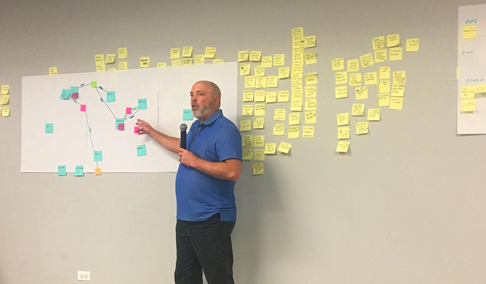

    

      

            

                

                

            

            

                <h1>An Intro to Boris the Spider and the Swift Method: DDD Techniques for a Modern System</h1>
                
Shaun Anderson
                March 30 - April 2, 2021 9:00 AM - 12:30 PM (MDT)

                
The Swift Method has become a popular technique to use DDD principles to discover how a system really wants to behave.  This method enables teams to get started on complex modernization efforts in days instead of weeks or months.

                
In this four day workshop we will explore the Swift Method by modeling a business called We B Foods. Lettuce be honest. Uber Eats is so 2019. We B Foods is a new rapidly growing start-up taking the online food delivery world by storm. We’re nacho typical company!

                <h2>Who is this for?</h2>
                
This workshop is aimed at experienced software developers and product owners. Enterprise software development is recommended.

                
                <h2>What you will learn</h2>
                
We will use the radical collaboration of the Swift Method to identify the “real” problems in a large scale application space and discover how to effectively modernize that system.

                
Techniques you will be a part of include:

                <ul>
                    <li>Event Storming Light</li>
                    <li>The Boris Exercise</li>
                    <li>Snap-E</li>
                    <li>Applying Tactical Patterns and Solutions</li>
                </ul>
                <h2>Agenda</h2>
                
Each session is 4 hours long

                
<strong>Session 1</strong>

                <ul>
                    <li>Understanding the problem - Complex problems / creative solutions</li>
                    <li>Aiming toward a solution - “How the system wants to behave”</li>
                    <li>Event Storming Lite</li>
                </ul>
                
<strong>Session 2</strong>

                <ul>
                <li>Discovering Service Candidates and Domains</li>
                <li>Thin Slice Definition</li>
                </ul>
                
<strong>Session 3</strong>

                <ul>
                    <li>Boris Exercise - Driving out a notional architecture</li>
                    <li>Snap - Rapid capture of work to be done</li>
                </ul>
                
<@strong>Session 4</@rachstrong>

                <ul>
                    <li>Tactical Patterns - Mapping technology to the solutions</li>
                    <li>War stories and real world examples</li>
                    <li>Lightning round - Apply to participants problem sets</li>
                </ul>
                <h2>Prerequisites</h2>
                
Previous development experience OR program management recommended. This course will not be focused on a specific technology.  A variety of participant roles makes for the best workshop!

                <h2 class="text-center">About Shaun Anderson</h2>
                

                
Shaun leads the Application Modernization Practice at VMware. He is the inventor of top down DDD techniques including the Swift Method and Boris Exercise. He spends most of his time slaying, starving and strangling monoliths and defining pragmatic solutions to complicated problems. He has a wealth of experience designing and building mission critical applications with technologies running the gamut from Akka to Zuul. Shaun has recently presented at ExploreDDD, Spring One and Cloud Foundry Summit.

                

                    <a class="btn" href="https://ti.to/EDDD/explore-ddd-2021-spring-workshops">REGISTER NOW</a>
                

            

        

    

