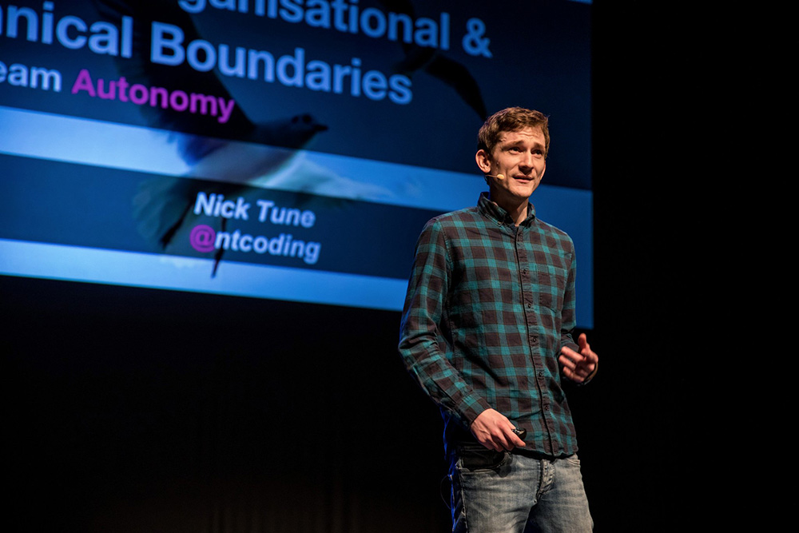

	<!-- begin workshop element -->
	

      

            

                

                

            

        

            <h1 class="section-header">DDD For Messaging Architectures</h1>
            <a href="../speakers/nick-tune.html">Nick Tune</a> &amp; <!--<a href="../speakers/zsofia-Herendi.html">-->Zsofia Herendi<!--</a>-->
            3-Day Workshop Mon-Wed, Sept 10-12
            <a class="btn get-ticket-btn" href="https://ti.to/explore-ddd-conference/explore-ddd-2018">GET YOUR TICKET</a>
            
Learn how to model a complex system and break it down into cohesive bounded contexts through hands-on group activities. This session will teach you skills you can immediately begin applying in your organisation to improve the autonomy of your software services and the teams that build and run them.

            
            
This session will involve modelling a complex domain with Event Storming and then applying strategic modelling heuristics to various scenarios involving a variety of challenging business, organisational, and technical goals and constraints.
 
            
Lots of curve balls will be thrown at you, and you’ll learn how to apply strategic modelling heuristics and find the best bounded contexts whatever the business goals, organisational realities and technical constraints may be. Along the way you will also learn about theoretical concepts, drawing on ideas from DDD, Systems Thinking, Promise Theory, Theory of Constraints, and more.

            
            <h2 class="speaker-subheader">Learning Outcomes</h2>
            
With a blend of hands-on team activities, whole-classroom exercises, and just enough theoretical discussion, you will learn:

            <ul class="copy-list">
                <li>How to find architectural boundaries in software systems aligned with the domain and business strategy
                <li>How to design team boundaries to optimise evolution of the software system
                <li>How to co-design and co-evolve team and software boundaries aligned to changing business priorities and market expectations
                <li>How to apply different economical, political, and technical modelling heuristics to find the best boundaries, including:
                    <ul class="copy-list">
                        <li>Optimising for existing core domains
                        <li>Balancing discovery of future core domains
                        <li>Optimising end-to-flow in systems
                        <li>Organising around social characteristics
                        <li>Data cohesion and consistency
                        <li>Linguistic boundaries
                        <li>Isolating modules with heightened performance, security, scalability concerns
                    </ul>
                </li>
                <li>How to identify and apply structural sociotechnical architecture patterns including:
                    <ul class="copy-list">
                        <li>The Dog Food Context</li>
                        <li>The Octopus context</li>
                        <li>The Entity Lifecycle Pipeline</li>
                        <li>Enterprise Discovery Context</li>
                    </ul>
                </li>
                <li>How to identify and apply evolutionary sociotechnical architecture patterns including:
                    <ul class="copy-list">
                        <li>Slice and Scale</li>
                        <li>Slice and Scatter</li>
                        <li>Slice and Merge</li>
                        <li>Business Model Unbundling</li>
                    </ul>
                </li>
                <li>How to use event storming, context maps, and domain storytelling to model the boundaries in sociotechnical systems</li>
            </ul>
            

                <a class="btn get-ticket-btn" href="https://ti.to/explore-ddd-conference/explore-ddd-2018">GET YOUR TICKET</a>
            

        

    

 <!-- container -->
